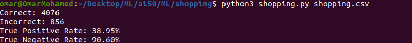

<h1 align="center">KNN classifier</h1>

  
   
  <i>AI to predict whether online shopping customers will complete a purchase.</i>
   

## Table of contents

- [Quick start](#Quick-start)
- [Code Flow](#Code-Flow)
- [Background](#Background)
- [Output](#Output)

## Quick start

- in order to run this code you should install `python3` on your machine.
- Dependancies `scikit-learn` `numpy` `pandas`
- Clone the repo `git clone https://github.com/omarmohamed101/Shopping.git`

## Background

 When users are shopping online, not all will end up purchasing something. Most visitors to an online shopping website, in fact, likely don’t end up going through with a purchase during that web browsing session. It might be useful, though, for a shopping website to be able to predict whether a user intends to make a purchase or not: perhaps displaying different content to the user, like showing the user a discount offer if the website believes the user isn’t planning to complete the purchase. How could a website determine a user’s purchasing intent? That’s where machine learning will come in.

## Code Flow

<ul>
    <li> load_data </li>
    <li> train_model </li> 
    <li> evaluate </li>
  </ul>

## Output

  

